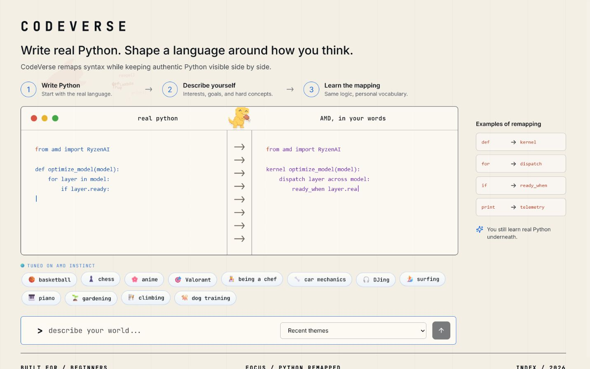
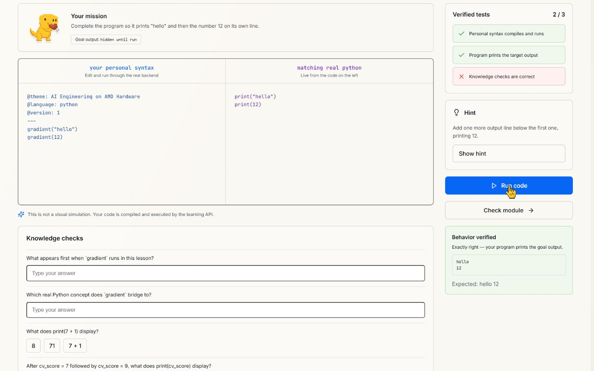
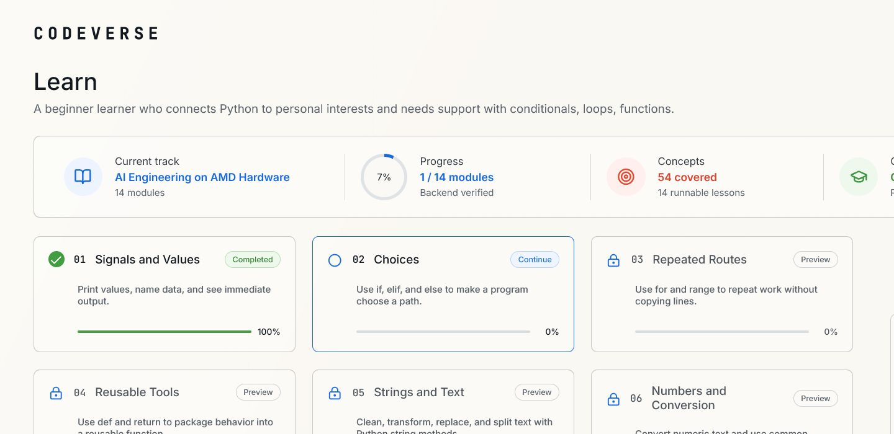

<div align="center">

# CodeVerse

### Turn how you think into real Python.

CodeVerse builds a personal syntax layer from a learner's own world, compiles it to standard Python, runs it in a sandbox, and gradually removes the scaffold until the learner can write Python independently.

[Live Product](http://codeverse.192.241.149.132.sslip.io/) | [AMD Evidence](amd/EVIDENCE.md) | [Deployment Guide](DEPLOY.md)


</div>



## What CodeVerse proves

Most personalized coding tools stop at changing labels. CodeVerse connects personalization to a real language pipeline and a measurable learning outcome.

| Capability | What happens |
| --- | --- |
| Personalization | A free-form learner prompt and clarifying answers become a structured learner profile and a Python concept dictionary. |
| Compilation | Personal tokens resolve to canonical Python concepts through a lexer, parser, semantic layer, and code generator. |
| Execution | Generated Python runs in an isolated Docker sandbox with CPU, memory, process, and timeout limits. |
| Learning | Lessons, exercises, hints, and progress adapt to the learner's personal vocabulary while always exposing real Python. |
| Graduation | The final bridge assessment accepts only standard Python, rejects remaining personal tokens, runs the program, and verifies its behavior. |

## One program, two vocabularies

The learner can begin with memorable cues:

```text
dispatch_protocol cv_double(cv_value):
    return_package cv_value * 2

radio_callout(cv_double(8))
```

CodeVerse compiles the same intent to standard Python:

```python
def cv_double(cv_value):
    return cv_value * 2

print(cv_double(8))
```

This is not direct string replacement. Every personal token maps to a canonical `UniversalConcept`; the resulting program must still satisfy Python grammar and semantic rules.

## Product flow

1. The learner describes any interest, experience, or difficulty in natural language.
2. A short clarifying wizard separates the learner's identity, preferred metaphors, and Python pain points.
3. The generation engine creates a quality-checked dictionary for about 210 Python concepts.
4. The learner writes Personal Python and sees the standard Python preview beside it.
5. The backend compiles, executes, and grades the real program instead of simulating success in the browser.
6. A 14-module curriculum reduces the scaffold from personal syntax to standard Python.
7. The graduation assessment proves transfer by requiring working, token-free Python.



## Architecture

```mermaid
flowchart LR
    A["Free-form learner prompt"] --> B["LLM learner profile"]
    B --> C["Personal concept dictionary"]
    C --> D["Personal Python editor"]
    D --> E["Lexer and resolver"]
    E --> F["Parser and UASL"]
    F --> G["Python code generation"]
    G --> H["Docker sandbox"]
    H --> I["Output, diagnostics, and grading"]
    I --> J["Learning progress and graduation"]
```



| Layer | Implementation |
| --- | --- |
| Frontend | React, TypeScript, Vite, Monaco Editor |
| API | FastAPI, SQLAlchemy, PostgreSQL or SQLite |
| Compiler | Indentation-aware lexer, parser, UASL, Python code generator, themed diagnostics |
| Runtime | Per-run sibling Docker containers with resource limits |
| LLM | Fireworks or any OpenAI-compatible provider, plus deterministic offline mode |
| Learning | Diagnosis, lessons, runnable exercises, behavioral grading, persistent mastery, graduation bridge |

## Learning system

The curriculum is designed to teach the real language rather than create dependence on the personal layer.

- Fourteen modules cover foundations, conditions, loops, functions, collections, files, errors, object-oriented programming, and transfer to standard Python.
- Concept, example, and practice views share one backend lesson contract.
- Exercises are graded by compilation, runtime behavior, expected output, and knowledge checks.
- Scaffold levels progressively reduce personalized syntax.
- The dictionary view keeps every personal token connected to its real Python concept.
- The graduation bridge rejects personal tokens and stores a persistent completion result only after real Python passes.



## AMD platform

CodeVerse includes an end-to-end teacher-to-student path designed for AMD Instinct hardware:

- `569` validated training conversations were generated from real CodeVerse prompt formats; `545` are used for training and `24` are held out.
- The LoRA notebook uses PyTorch and ROCm on AMD Instinct infrastructure.
- The trained student is served through an OpenAI-compatible endpoint and selected through the same provider interface used by the product.
- The public application is hosted on AMD Developer Cloud.
- A raw production database export records a successful dictionary generated by the AMD-hosted `codeverse-student` endpoint.

Review the reproducible artifacts in [amd/README.md](amd/README.md), the [training notebook](amd/codeverse_finetune_amd.ipynb), the [dataset](amd/codeverse_theme_sft.jsonl), and the [production evidence record](amd/evidence_amd_generated_theme.json).

## Repository map

```text
backend/             FastAPI application, compiler, learning engine, and tests
frontend/            React product interface and Monaco integrations
amd/                 Training data, AMD notebook, and production evidence
deploy/              Production deployment configuration
docs/assets/         Real product screenshots used in this README
docker-compose.yml   Full local and production-compatible stack
DEPLOY.md             AMD Developer Cloud deployment procedure
```

## Run locally

Prerequisites: Python 3.12, Node.js, and Docker Desktop.

```powershell
# Backend
python -m venv .venv
.\.venv\Scripts\pip install -e backend
.\.venv\Scripts\python -m uvicorn codeverse_api.main:app --reload --app-dir backend/src

# Frontend, in another terminal
cd frontend
npm install
npm run dev
```

Create `.env` from `.env.example`. Use `CODEVERSE_LLM_PROVIDER=fake` for a deterministic offline run, or configure Fireworks/OpenAI-compatible credentials for live generation.

Run verification:

```powershell
.\.venv\Scripts\python -m pytest backend/tests -q
cd frontend
npm run lint
npm run build
```

## Deploy

The public stack uses Nginx, FastAPI, PostgreSQL, and Docker sandbox runtimes:

```bash
git pull --ff-only origin main
docker compose up -d --build
```

See [DEPLOY.md](DEPLOY.md) for environment variables, runtime images, health checks, and update steps.

## License

This project is licensed under the [MIT License](LICENSE).

---

<div align="center">

Built for the AMD Developer Hackathon ACT II, Track 3.

**Personal vocabulary in. Working Python out. Real Python at graduation.**

</div>
